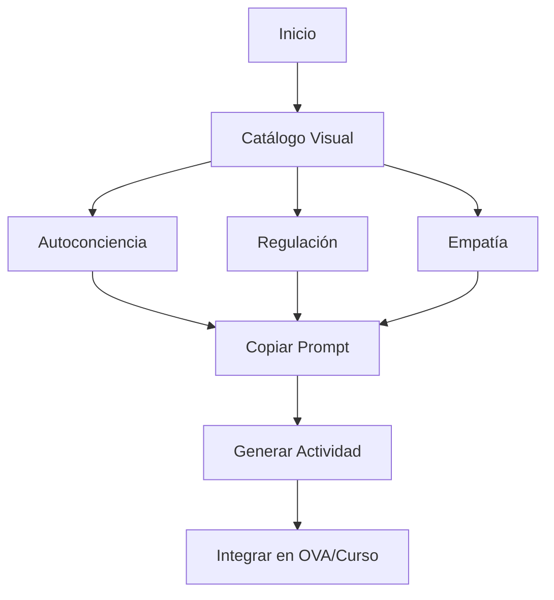

# 🌟 Prompts RITA para Inteligencia Emocional


Repositorio con prompts diseñados usando el modelo **RITA** (Rol, Intención, Tareas/Técnicas, Audiencia) para actividades de **inteligencia emocional** en contextos educativos.

---

## 📚 Índice
- [Descripción](#descripción)
- [Cómo usar](#cómo-usar)
- [Catálogo visual](#catálogo-visual)
- [Selección rápida](#selección-rápida)
- [Ejemplo de salida](#ejemplo-de-salida)
- [Diagrama Mermaid](#diagrama-mermaid)
- [GitHub Pages](#github-pages)
- [HTML opcional](#html-opcional)
- [Cómo contribuir](#cómo-contribuir)
- [Nota](#nota)
- [Licencia](#licencia)

---

## 📝 Descripción
Incluye:
- Plantilla RITA
- Prompts: Autoconciencia, Regulación, Empatía
- Esquema JSON
- Ejemplo de salida

---

## ✅ Cómo usar
1. Selecciona un prompt del catálogo.
2. Pega en tu asistente IA.
3. (Opcional) Solicita salida doble: **Markdown + JSON** según `schemas/salida_rutina_ie.schema.json`.

---

## 🎨 Catálogo visual

| Prompt | Descripción | Acción |
|--------|-------------|--------|
|  | Identificar emociones | [➡ Ver Prompt](prompts/01_autoconciencia.md) |
|  | Respiración y reencuadre | [➡ Ver Prompt](prompts/02_regulacion.md) |
|  | Escucha activa | [➡ Ver Prompt](prompts/03_empatia.md) |

---

## 🔘 Selección rápida
<p align="center">
  <a href="prompts/01_autoconciencia.md"></a>
  <a href="prompts/02_regulacion.md"></a>
  <a href="prompts/03_empatia.md"></a>
</p>

---

## 📌 Ejemplo de salida
Consulta `ejemplos/ejemplo_salida.md` para ver un ejemplo completo en **Markdown + JSON**.

---

## 🧭 Diagrama Mermaid
[Ver diagrama renderizado](#diagrama-mermaid) — si estás viendo este archivo en GitHub, el diagrama se renderiza automáticamente.



---

## 🌐 GitHub Pages
Sigue estos pasos para publicar este repositorio como una **landing**:

1. Ve a **Settings → Pages**.
2. En **Source**, selecciona **Branch: main** y carpeta **/root** (o `/docs` si usas esa carpeta).
3. Guarda (**Save**).
4. Espera a que GitHub genere la URL pública de tu sitio.
5. (Opcional) Personaliza el tema en **Settings → Pages → Theme chooser**.

> Nota: Mermaid se renderiza en GitHub Markdown; en GitHub Pages con Jekyll también funciona en la mayoría de temas modernos.

---

## 💻 HTML opcional
Inserta este bloque en `index.md` (si activas Pages) para tener **botones grandes** tipo landing:

```html
<div style="display:flex; gap:16px; justify-content:center; flex-wrap:wrap;">
  <a href="prompts/01_autoconciencia.md" style="background:#1f6feb;color:#fff;padding:14px 20px;border-radius:10px;text-decoration:none;font-weight:600;">Autoconciencia</a>
  <a href="prompts/02_regulacion.md" style="background:#238636;color:#fff;padding:14px 20px;border-radius:10px;text-decoration:none;font-weight:600;">Regulación</a>
  <a href="prompts/03_empatia.md" style="background:#d29922;color:#fff;padding:14px 20px;border-radius:10px;text-decoration:none;font-weight:600;">Empatía</a>
</div>
```

---

## 📝 Cómo contribuir
¡Contribuciones bienvenidas!

1. **Haz un fork** del repositorio.
2. Crea una rama: `git checkout -b feat/nuevo-prompt`.
3. Sigue la **plantilla RITA** (`prompts/00_plantilla_RITA.md`).
4. Asegura formato y tono; añade ejemplo JSON si aplica.
5. Commit con convención: `feat: agrega prompt de [tema]` / `docs: mejora README`.
6. **Pull Request** hacia `main` con descripción clara y capturas si aplica.

Checklist para PRs:
- [ ] Archivo en `prompts/` con nombre claro (ej.: `04_autocompasion.md`).
- [ ] Cumple estructura RITA.
- [ ] Incluye nota de seguridad.
- [ ] Añadido al Catálogo del README.

---

## ⚠ Nota
Estos materiales **no sustituyen orientación psicológica profesional**. Detén cualquier práctica si genera malestar significativo.

---

## 📄 Licencia
MIT o CC BY 4.0 (elige la que prefieras).
